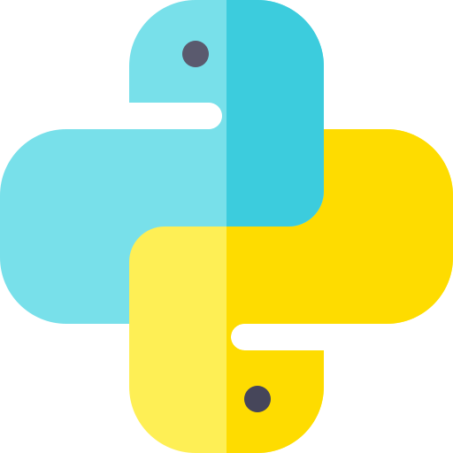

  

 

  
 
    
    <h2 align="center">Main Skills</h2>
    
    
    
    
    
    
   

    
  
### Tools:
&nbsp;
&nbsp;
&nbsp;

  

  
  
    <h2 align="center">Redes Sociais</h2>
       
   

  

